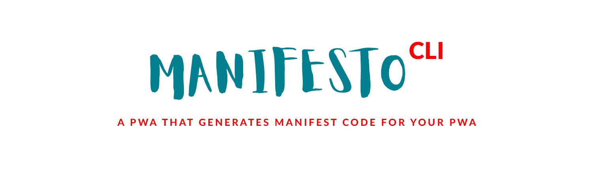
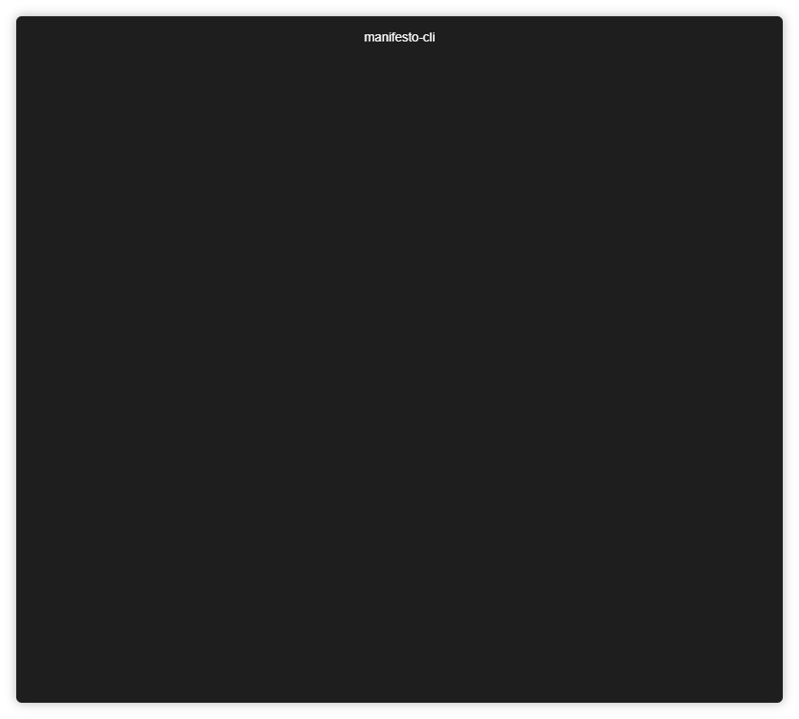
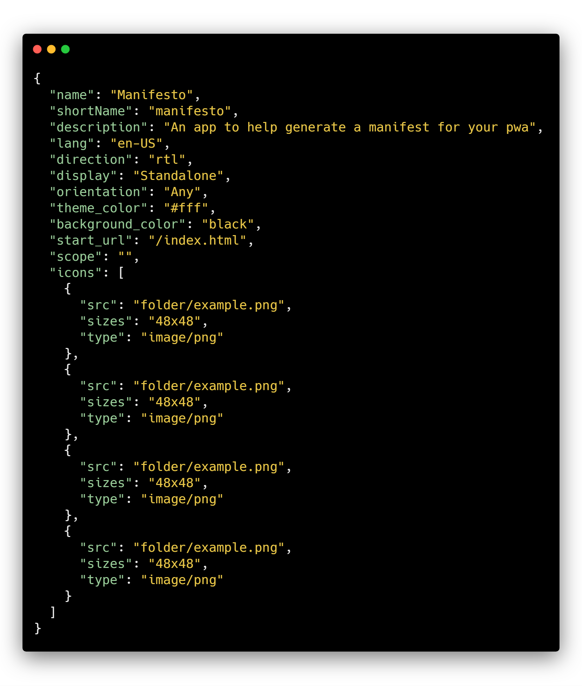

[](https://github.com/blurdylan/manifesto-cli)

<p align="center"><a href="https://twitter.com/dylantientcheu"></a><a href="https://github.com/blurdylan/manifesto-cli/blob/master/license"></a><a href="https://github.com/blurdylan/manifesto-cli/graphs/commit-activity"></a><a href="https://github.com/blurdylan/manifesto-cli/blob/master/license"></a></p>

---

> ⚡️ A CLI app that helps generate a manifest file for your PWA.

## Table of Contents

- [Description](#description)
- [Installation](#installation)
- [Usage](#usage)
- [Examples](#examples)
- [License](#license)

## Description

[Manifesto](https://blurdylan.github.io/manifesto/#/) by [@dylantientcheu](https://twitter.com/dylantientcheu) is a beautiful tool that helps generate a manifest file for your upcoming PWA along with tooltiped documentation to follow you up.

`manifesto-cli` gives you the **all the features of Manifesto** — right **inside the terminal**.

Generate a **minimal to full** PWA manifest interactively from start to finish 😎.



## Installation

If you need to have it globally

#### npm

```
npm i -g manifesto-cli
```

#### yarn

```
yarn global add manifesto-cli
```

#### npx

```
npx manifesto-cli generate --minimal
```

#### Requirements


## Usage

```
$ manifesto-cli --help

A CLI app that helps generate a manifest file for your PWA

Usage
  $ manifesto-cli generate [options]

Options
  -m, --minimal         Quickly generate the most minimal web manifest possible.

Examples
  See: https://github.com/blurdylan/manifesto-cli#examples
```

**Note**: You can also access the docs using

```
  manifesto-cli docs
```

## Example

```
manifesto-cli generate
```

Manifesto cli will prompt you to enter some information regarding your app, after which your manifest [manifest.json] will be generated in the current file ✌.

**Result**:



## License

MIT © [Dylan Tientcheu](https://twitter.com/dylantientcheu)
